# Comparing three or more groups

PaintOmics compares any number of groups. Give it one log2 fold-change column
per contrast, and a relevant-features file with one list of significant
features per contrast; every pathway then gets its own p-value for each
comparison, beside one that combines them.

This page runs the whole workflow on a three-group example — mouse RNA-seq and
lipidomics, groups `Ctrl`, `TrtA` and `TrtB`, four animals each — from raw
counts to the painted pathways. The red numbers on the screenshots are the
numbered steps in the text.

## What you need

* **The example data:**
  [paintomics-three-group-example.zip](example-data/paintomics-three-group-example.zip)
  (0.6 MB). It holds raw RNA-seq counts and lipid intensities for the 12
  animals, an R script that turns them into PaintOmics files, the four files the
  script makes, and the answer key `PLANTED_SIGNAL.tsv`. If you only want to
  try PaintOmics, the four upload files are already in its `paintomics_inputs`
  folder: skip to Step 2.
* **R 4.2 or later with DESeq2 and limma**, for Step 1 only. The script was
  tested with R 4.6.0 and DESeq2 1.52.0.
* **[paintomics.org](https://paintomics.org)**, or your own installation with
  *Mus musculus*.

!!! note "The example data are simulated"
    The gene and compound identifiers and the pathway structure are real mouse
    KEGG; the numbers are not. Seven KEGG pathways were made to change — some
    in both treatments, some in one — so you can check that the analysis
    recovers what was put in. Draw no biological conclusion from them.

## Step 1 — Make one column per contrast

PaintOmics paints one value per feature per column, so three groups become
pairwise contrasts. Unzip the example and run `Rscript make_paintomics_inputs.R`
in that folder; it writes four files to `paintomics_inputs/` in under a minute.

The only part you edit is the settings block at the top of the script:

```r
reference_group <- "Ctrl"
group_levels    <- c("Ctrl", "TrtA", "TrtB")

# one entry per column PaintOmics will show: name = c(numerator, denominator)
contrasts <- list(
  TrtA_vs_Ctrl = c("TrtA", "Ctrl"),
  TrtB_vs_Ctrl = c("TrtB", "Ctrl"),
  TrtB_vs_TrtA = c("TrtB", "TrtA")
)
fdr_cutoff <- 0.05   # adjusted p-value that makes a feature "relevant"
```

What the script does with it:

1. **RNA-seq, with DESeq2.** It strips the Ensembl version suffix
   (`ENSMUSG00000000001.5` becomes `ENSMUSG00000000001`, because gene
   identifiers are matched exactly), drops genes with fewer than 10 reads in 4
   samples, fits `~ group` once, and takes
   `results(dds, contrast = c("group", "TrtA", "Ctrl"))` for each contrast.
2. **Lipids, with limma.** It keeps species detected in at least 75% of the
   samples of one group, fills the remaining gaps with half that species'
   smallest value, sums the species into their KEGG lipid class — every PC
   species into `C00157`, Phosphatidylcholine — takes log2 and tests each
   contrast.
3. **It writes** the log2 fold changes as the values files, and the features
   with FDR < 0.05 in each contrast as the relevant-features files.

| File | Header row | Then |
|---|---|---|
| `rnaseq_values.tsv` | `#gene_id  TrtA_vs_Ctrl  TrtB_vs_Ctrl  TrtB_vs_TrtA` | one gene per row, one log2 fold change per contrast |
| `rnaseq_relevant.tsv` | `TrtA_vs_Ctrl  TrtB_vs_Ctrl  TrtB_vs_TrtA` | one list of significant genes per column — 230, 315 and 398 here — with blank cells where a list ends |
| `lipids_values.tsv` | `#kegg_id  TrtA_vs_Ctrl  TrtB_vs_Ctrl  TrtB_vs_TrtA` | one KEGG compound per row |
| `lipids_relevant.tsv` | `TrtA_vs_Ctrl  TrtB_vs_Ctrl  TrtB_vs_TrtA` | one list per column — 10, 9 and 11 compounds |

Two rules make this work. The values header starts with `#` and the
relevant-features header does not: with two contrasts, a `#` there makes
PaintOmics read the file as a regulator–target pair list (see
[per-condition relevance](2_1_accepted_input.md#per-condition-relevance)).
And the contrast names must be the same, in the same order, in all four files —
every omic in a job has to carry the same number of value columns.

## Step 2 — Choose the organism and describe the design

Open PaintOmics and scroll to **1. Organism selection**.

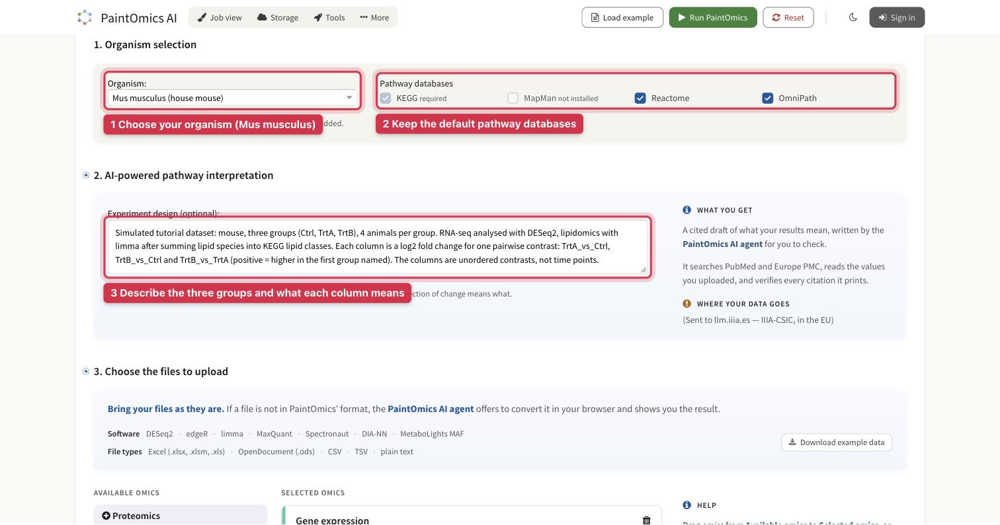

*The upload form, with the three things set in this step.*

**1.** **Organism:** type `Mus musculus` and pick *Mus musculus (house mouse)*.

**2.** **Pathway databases:** leave the defaults. For mouse these are KEGG,
Reactome and OmniPath.

**3.** **Experiment design:** say what the groups are and what each column means.
The [AI interpretation](ai-interpretation.md) reads this text together with
your column headers, and it needs to know that the columns are pairwise
contrasts rather than time points. The example used:

> Mouse, three groups (Ctrl, TrtA, TrtB), 4 animals per group. RNA-seq
> analysed with DESeq2, lipidomics with limma after summing lipid species
> into KEGG lipid classes. Each column is a log2 fold change for one
> pairwise contrast: TrtA_vs_Ctrl, TrtB_vs_Ctrl and TrtB_vs_TrtA (positive =
> higher in the first group named). The columns are unordered contrasts,
> not time points.

## Step 3 — Upload the four files and run

Scroll to **3. Choose the files to upload**. The **Gene expression** and
**Metabolomics** cards are already on the form; the lipids go in the
Metabolomics card.

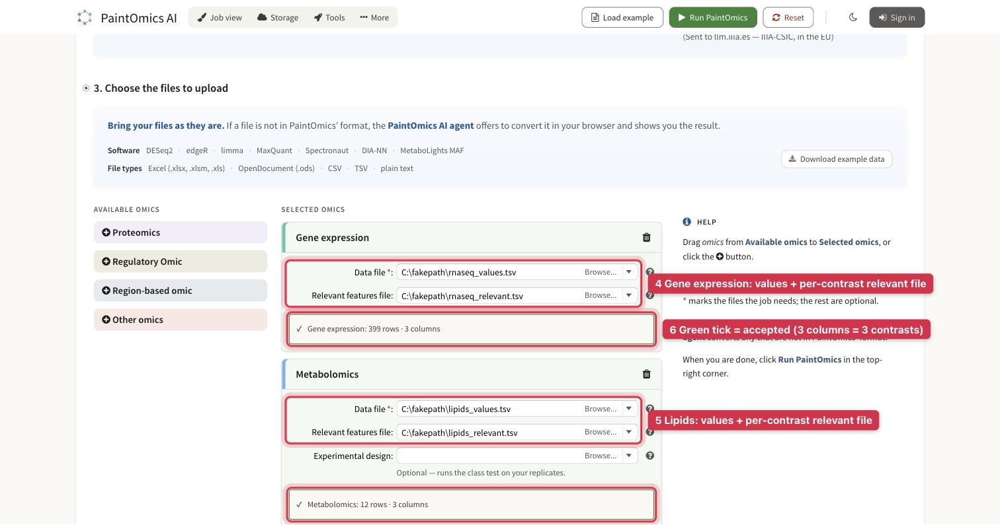

*Both cards green: each file was read with three value columns.*

**4.** **Gene expression:** in **Data file** choose `rnaseq_values.tsv`, and in
**Relevant features file** choose `rnaseq_relevant.tsv`.

**5.** **Metabolomics:** the same with `lipids_values.tsv` and
`lipids_relevant.tsv`. Leave **Experimental design** empty; it is for files
with one column per sample.

**6.** **Wait for the green tick.** The browser checks each file as you pick it, and
`3 columns` means it read your three contrasts. Amber offers a one-click
repair; red means the file is in the wrong shape — see
[what happens when you pick a file](2_1_accepted_input.md#what-happens-when-you-pick-a-file).

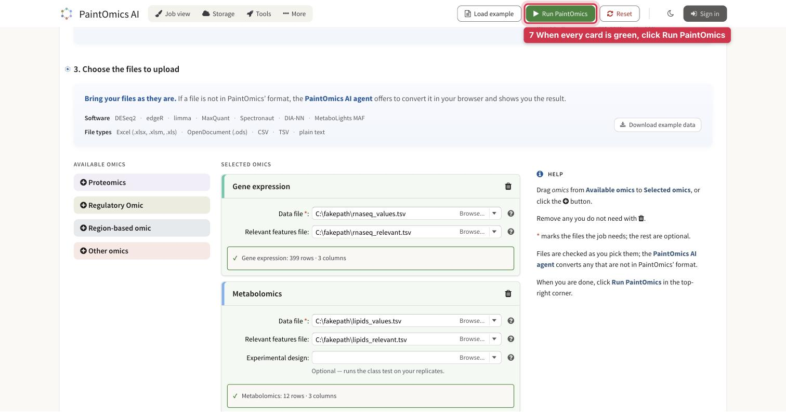

**7.** When both cards are green, click **Run PaintOmics** in the top-right corner.
The job uploads, queues and maps your identifiers; for the example this took
under a minute.

## Step 4 — Check the identifier mapping

The second screen reports how many of your features PaintOmics could place on
pathways. In the example, all 15,094 genes and all 33 lipid compounds map to
KEGG.

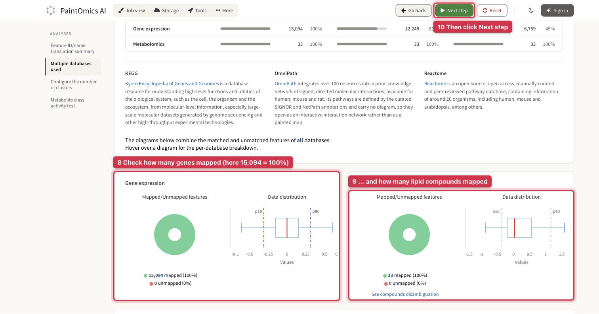

**8.** **Gene expression card:** green is mapped, red is not. With real data, aim
for most of the file to be green; [when a file matches
poorly](2_1_accepted_input.md#when-a-file-matches-poorly) lists what to try.

**9.** **Metabolomics card:** the same for the lipids. If few of them map, they are
probably species-level identifiers — see [the last section](#on-your-own-data).

**10.** Further down, the **Metabolite class activity test** shows a threshold of
0.05. That is the FDR cut-off the script used, so leave it. Click
**Next step** in the top bar; the pathway analysis takes about a minute.

## Step 5 — Read one p-value per contrast

On the results page, click **Pathway enrichment** in the left menu.

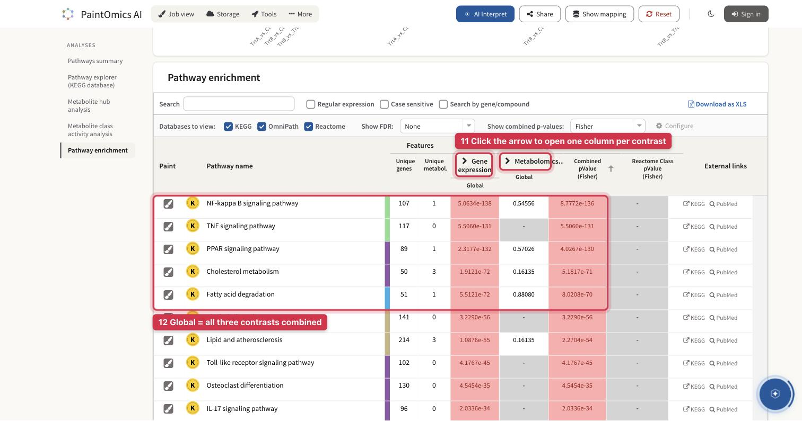

**11.** Each omic's column header carries an arrow, because your relevant-features
files hold one list per contrast. Click the arrow next to
**Gene expression**.

**12.** Until you do, the column shows only **Global**: the three contrasts
combined by Fisher's method. It ranks the pathways, but it does not say
which group drives them.

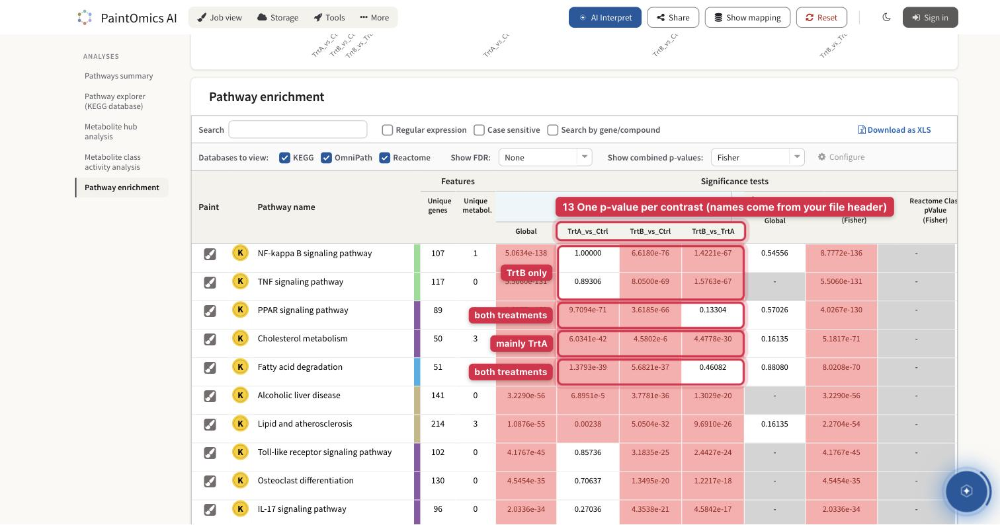

**13.** The column opens into **Global** plus one sub-column per contrast, named
from your file's header. Each cell is a separate
[enrichment test](4_1_pathway_enrichment.md#one-test-per-condition) against
that contrast's own significant genes; cells at or below 0.065 are tinted
red, more deeply the smaller they are.

Read each row across the three contrast columns:

| Pattern | TrtA_vs_Ctrl | TrtB_vs_Ctrl | TrtB_vs_TrtA | In the example |
|---|---|---|---|---|
| Changed by both treatments alike | small | small | not significant | PPAR signaling: 9.7e-71 · 3.6e-66 · 0.13; Fatty acid degradation: 1.4e-39 · 5.7e-37 · 0.46 |
| Changed by TrtA only | small | not significant | small | Steroid biosynthesis: 1.1e-14 · 0.41 · 2.2e-12 |
| Changed by TrtB only | not significant | small | small | NF-kappa B signaling: 1.00 · 6.6e-76 · 1.4e-67; TNF signaling: 0.89 · 8.1e-69 · 1.6e-67 |

The third contrast is what separates "both" from "one": a response the two
treatments share cancels out in `TrtB_vs_TrtA`. Overlapping pathways can blur
the pattern. Cholesterol metabolism (6.0e-42 · 4.6e-6 · 4.5e-30) was changed in
TrtA only, yet reaches 4.6e-6 in TrtB, because 9 of its 50 genes also belong to
the PPAR pathway, which responds in both groups. Check the genes (Step 7) before
calling a pathway specific to one group.

The **Combined pValue** column merges each omic's Global value across omics:
use it to rank, and the contrast columns to explain. **Download as XLS**
exports only the visible columns, so open the contrasts before exporting.

## Step 6 — The lipids, per contrast

Click the arrow next to **Metabolomics** to open its contrasts as well; close the
Gene expression group first if the table runs off the screen.

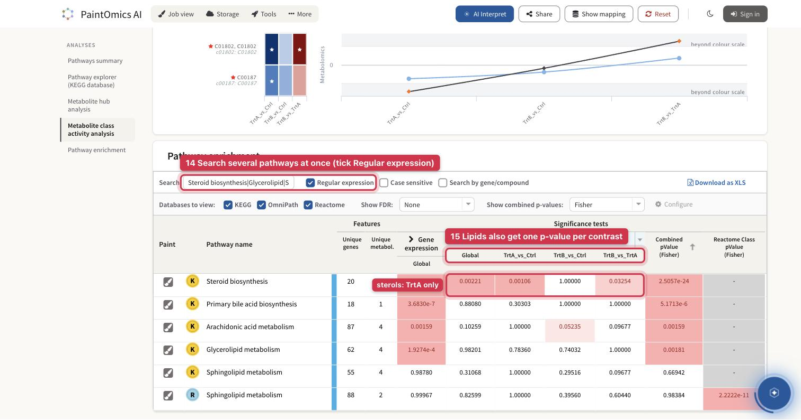

**14.** To look at several pathways at once, tick **Regular expression** and search
`Steroid biosynthesis|Glycerolipid|Sphingolipid metabolism|Arachidonic|Primary bile`.

**15.** The lipids get one p-value per contrast too. Steroid biosynthesis reads
0.0011 in `TrtA_vs_Ctrl` and 1.00 in `TrtB_vs_Ctrl`: the sterols fall in
TrtA only, as the genes did.

Expect lipid p-values to be weaker than gene p-values. Summed to KEGG classes, a
lipid panel gives each pathway between one and five measured compounds, so even
a real change rarely reaches a small p-value — arachidonic acid metabolism in
TrtB reads 0.052. Read the lipids on the painted pathway instead (next step).
The [metabolite hub analysis](4_4_metabolite_hub_analysis.md) on the same page
helps too: in the example its top hits are planted compounds — leukotriene B4,
triacylglycerol, cholesterol ester and cholesterol.

## Step 7 — Paint a pathway and read its heatmap

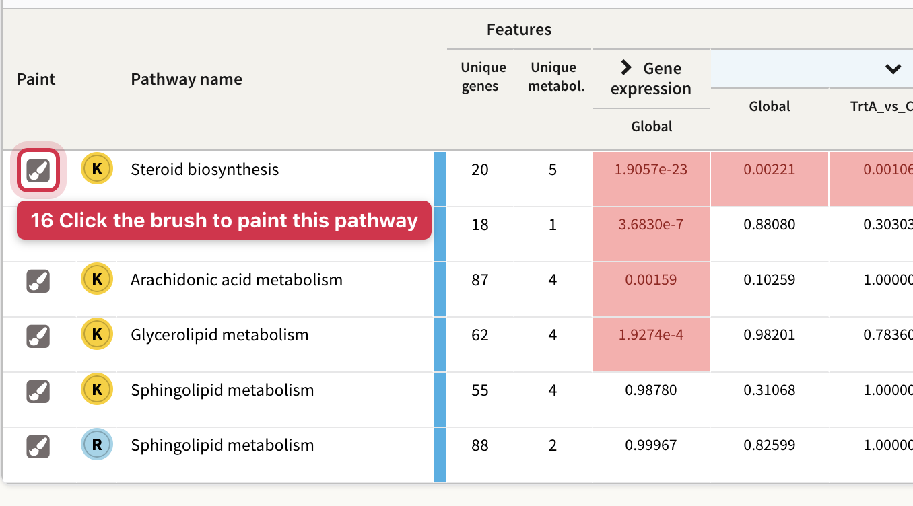

**16.** Click the brush in a row's first column. Steroid biosynthesis is a good
first choice in the example, because it carries both genes and lipids.

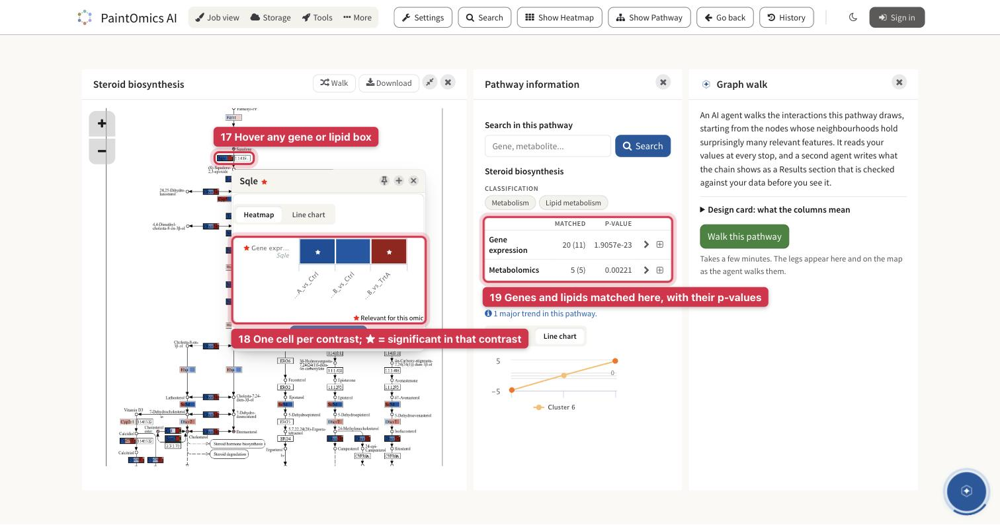

**17.** Every painted gene and compound box holds one cell per contrast, left to
right in your column order. Hover a box to see its values.

**18.** The pop-up has one cell per contrast, and a star marks the contrasts in
which that feature is on your relevant list. Sqle is starred in
`TrtA_vs_Ctrl` (log2 fold change −1.36) and in `TrtB_vs_TrtA` (+0.91), and
not in `TrtB_vs_Ctrl` (−0.46).

**19.** **Pathway information** gives the pathway's matched features and p-values:
20 genes, 11 of them relevant, and 5 lipids, all relevant.

The colours saturate early. By default the scale runs between the 10th and
90th percentiles of your data — ±0.31 log2 for these genes — so −0.46 is
already full blue. Trust the stars for significance, and widen the range under
**Settings** → **Coloring options** → **Reference values** if you want to; see
[where the ends of the scale come from](5_1_browsing_pathways.md#where-the-ends-of-the-scale-come-from).

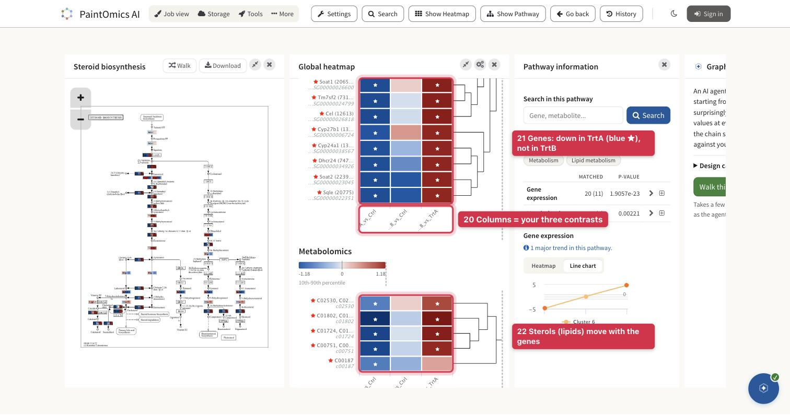

**20.** Click **Show Heatmap** in the top bar, then **Apply**. Each omic gets a block
whose columns are your three contrasts; [Heatmaps](5_3_heatmaps.md) covers
the options.

**21.** The relevant genes of Steroid biosynthesis are blue and starred in
`TrtA_vs_Ctrl`, near zero in `TrtB_vs_Ctrl`, and red in `TrtB_vs_TrtA`:
lower in TrtA than in either other group.

**22.** The five sterols — cholesterol ester, desmosterol, lanosterol, squalene and
cholesterol — follow the genes. Agreement between genes and lipids, contrast
by contrast, is the multi-omic evidence for an effect specific to one group.

## Step 8 (optional) — The AI interpretation

The AI interpretation runs in the background while you browse the results. When
the round mark in the bottom-right corner shows a green tick, click it, or
**AI Interpret** in the results toolbar.

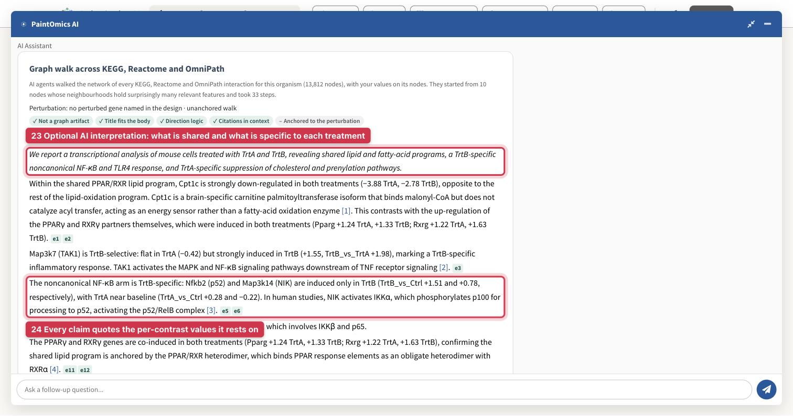

**23.** Because the design text named the contrasts, the summary sorts the result
the way the signal was planted: shared lipid and fatty-acid programmes, a
TrtB-specific NF-κB response, and TrtA-specific suppression of the
cholesterol and prenylation pathways.

**24.** Every claim quotes the per-contrast values it rests on, and every citation
is checked against the paper.

Treat it as a first draft to check against your own reading of Steps 5 to 7.
On this simulated example, its literature statements describe real genes, not
findings about TrtA or TrtB. See [The interpretation](ai-interpretation.md).

## On your own data

Replace the four files in `raw_data/` with yours, keeping their layout, and edit
the settings block:

* **Groups and contrasts.** Put your group names in `group_levels` and keep the
  contrasts you need. Two contrasts against a control are fine; the script still
  writes the header row that a two-column relevant-features file needs.
* **Gene identifiers.** The first column of the counts table is the gene
  identifier. Ensembl, NCBI Gene and gene symbols all map for mouse; symbols are
  case-sensitive (`Gnai3`, not `GNAI3`). See
  [supported identifiers](1_4_id.md).
* **Lipids.** List each of your lipid classes in `lipid_class_to_kegg.tsv`,
  with the KEGG compound it is drawn as. KEGG draws lipids per class, so a
  species-level ChEBI or SwissLipids identifier has no KEGG entry to map to.
* **No natural reference group** — three tissues, say? Use the group means
  instead: as values, each group's mean log2 expression minus the mean of the
  three; as the one relevant list, the genes significant in
  `DESeq(dds, test = "LRT", reduced = ~ 1)`. You then get one test per pathway,
  without the split by contrast.

| Symptom | Cause | Fix |
|---|---|---|
| No arrow on the omic column, so no per-contrast p-values | The relevant-features file is a single list | One column per contrast, under a plain header of contrast names |
| An omic is refused for its number of columns | Every omic in a job must carry the same number of value columns | The same contrasts, in the same order, in the RNA-seq and the lipid files |
| Huge values such as 2017143390864550, or the file turns red | A decimal comma was lost: `2,0171…` written by a spreadsheet set to a comma locale | Write the files from R and do not re-save them in a spreadsheet. On a tab-separated file, the amber **Use dots as the decimal mark** repair fixes it |
| Few genes map | Ensembl version suffixes such as `.5`, or the wrong organism | The script strips suffixes; check the organism in Step 2 |
| Almost no lipids map | Species-level identifiers (`PC 34:1`, or the ChEBI number of one species) | Sum species into classes and use the class's KEGG compound (`C00157` PC, `C00422` TG). A ChEBI identifier maps only when ChEBI cross-references it to KEGG |
| A two-column relevant-features file behaves oddly | With no header, or a header starting with `#`, two columns of identifiers are read as a regulator–target pair list | A plain header row of contrast names, without `#` |
| The contrasts show up as *Condition 1, 2, 3*, or the first list is missing | A contrast name with four or more digits in a row, or a colon (`Day1000`, `KO:WT`), makes the header look like data | Short names such as `TrtA_vs_Ctrl` |

The DESeq2 contrast syntax the script uses is the one described in the
[DESeq2 vignette](https://bioconductor.org/packages/release/bioc/vignettes/DESeq2/inst/doc/DESeq2.html).
